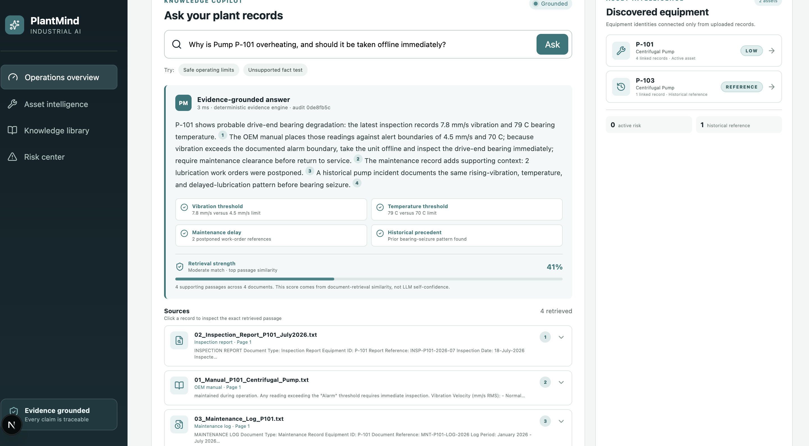
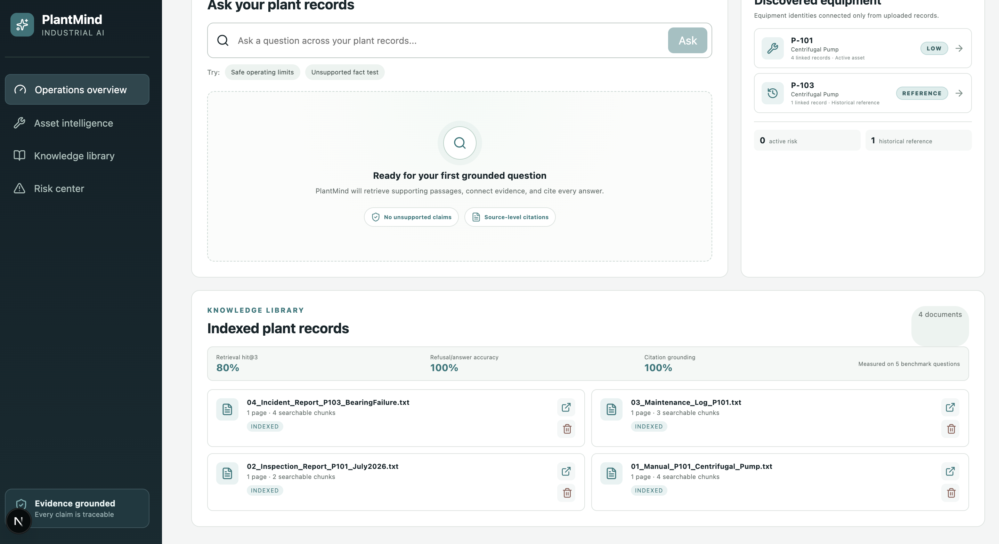
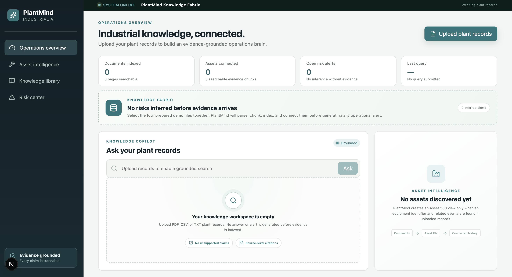
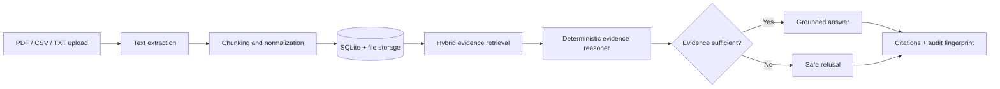

# PlantMind AI

### Evidence-grounded intelligence for industrial operations

> **PlantMind does not just answer plant questions—it shows the evidence behind every operational claim.**

Built for **ET AI Hackathon 2026 · Problem Statement 8: Industrial Knowledge Intelligence**.

PlantMind converts fragmented equipment manuals, inspection reports, maintenance logs, and incident reviews into fast, traceable answers. It connects evidence across documents, highlights operational risk patterns, provides exact source citations, and refuses to guess when the records are insufficient.

`Next.js` · `TypeScript` · `Node.js` · `Express` · `SQLite` · `Hybrid Retrieval` · `Redis-ready`

---

## The problem

Critical plant knowledge is scattered across PDFs, spreadsheets, inspection reports, work orders, and historical incident files. Engineers must manually search and reconcile those records before making time-sensitive maintenance decisions.

That creates three risks:

- Slow access to operational knowledge
- Missed relationships between limits, readings, maintenance delays, and incidents
- Unverifiable AI answers that cannot be trusted in a safety-sensitive environment

## The solution

PlantMind creates an evidence layer over existing plant records:

1. Upload PDF, CSV, or TXT documents.
2. Extract, normalize, chunk, and index their contents.
3. Connect records using discovered equipment identities.
4. Retrieve the strongest passages for each question.
5. Compare readings, OEM limits, maintenance history, and incident precedent.
6. Answer with claim-level citations—or clearly refuse when evidence is missing.

## Product preview

### Cross-document diagnosis with four traceable sources



### Indexed records and discovered equipment



<details>
<summary><strong>View the evidence-safe empty workspace</strong></summary>



</details>

## Why PlantMind stands out

| Capability | What PlantMind demonstrates |
|---|---|
| Evidence grounding | Answers are built only from uploaded plant records |
| Claim-level citations | Numbered claims map to exact retrieved passages |
| Cross-document reasoning | Manuals, inspections, maintenance logs, and incidents are evaluated together |
| Safe refusal | Unsupported facts return **Insufficient evidence**, not a hallucination |
| Retrieval strength | The displayed score comes from passage similarity, not LLM self-confidence |
| Asset intelligence | Equipment identities and linked histories are discovered from the corpus |
| Auditability | Each query produces an audit fingerprint with sources and generation mode |
| Reliable demo mode | The local deterministic engine works without an API key |

## Demo scenario

The included synthetic records describe Pump P-101:

- OEM vibration and bearing-temperature limits
- A recent inspection showing rising vibration and temperature
- Postponed bearing-lubrication work
- A historical same-series bearing-failure incident

Ask:

```text
Why is Pump P-101 overheating, and should it be taken offline immediately?
```

PlantMind connects all four records, distinguishes alert and alarm boundaries, recommends immediate inspection, and cites each supporting source.

Then test its refusal behavior:

```text
What is the manufacturing date of Pump P-101's motor?
```

The relevant manual is reviewed, but because the requested fact is absent, PlantMind declines to infer an answer.

> The bundled documents are realistic **synthetic demonstration records**. They are not confidential factory data.

## Architecture



### Technology stack

| Layer | Technology |
|---|---|
| Frontend | Next.js, React, TypeScript, Lucide icons |
| API | Node.js, Express, TypeScript |
| Persistence | SQLite and local file storage |
| Retrieval | Lexical matching, deterministic local vectors, industrial synonym normalization |
| Processing | Asynchronous local queue with optional Redis backing |
| Generation | Deterministic evidence engine with optional grounded LLM rewriting |
| Testing | Vitest regression and retrieval benchmark suite |

## Evidence pipeline

```text
Upload → Extract → Chunk → Index → Retrieve → Reason → Answer or refuse → Cite → Audit
```

- PDFs are extracted page by page.
- CSV rows become labelled searchable records.
- TXT files are normalized and divided into overlapping evidence chunks.
- Uploaded files, metadata, and chunks persist locally.
- Queries combine lexical relevance, local vector similarity, and industrial synonyms.
- Answers expose document name, page, excerpt, exact passage, and source link.
- Cache keys include a corpus fingerprint, preventing stale answers after document changes.

## Run locally

### Prerequisites

- Node.js 20+
- npm
- Python 3 with `pypdf` for PDF extraction

### Installation

```bash
git clone https://github.com/thanujaa9/plantmind-ai.git
cd plantmind-ai
npm install
python3 -m pip install pypdf
cp .env.example .env
npm run dev
```

Open [http://localhost:3000](http://localhost:3000).

- Web application: `http://localhost:3000`
- API: `http://localhost:4000`
- Synthetic demo records: [`demo-documents/`](demo-documents/)

No API key or hosted service is required for the default local experience.

## Configuration

All integrations are optional:

```env
DATA_DIR=./apps/data
PYTHON_BIN=python3

UPSTASH_REDIS_REST_URL=
UPSTASH_REDIS_REST_TOKEN=

LLM_API_URL=
LLM_API_KEY=
LLM_MODEL=
```

When an OpenAI-compatible endpoint is configured, the model may rewrite the verified deterministic draft using the cited passages. Missing credentials, timeouts, empty responses, or provider failures automatically fall back to deterministic generation.

## Verification

```bash
npm test
npm run build
npm run evaluate
```

- **19 automated tests passing**
- Regression coverage for refusal, ranged thresholds, hypothetical boundaries, asset classification, citation grounding, maintenance extraction, and deterministic retrieval consistency
- Production builds verified for both API and web workspaces

## API overview

| Method | Endpoint | Purpose |
|---|---|---|
| `GET` | `/health` | API and cache health |
| `GET` | `/api/dashboard` | Corpus and asset statistics |
| `POST` | `/api/documents` | Upload a plant record |
| `GET` | `/api/documents` | List indexed documents |
| `DELETE` | `/api/documents/:id` | Delete a document and its chunks |
| `POST` | `/api/ask` | Ask an evidence-grounded question |
| `GET` | `/api/assets` | List discovered equipment |
| `GET` | `/api/assets/:id` | Retrieve an Asset 360 profile |
| `GET` | `/api/audit` | View recent audit events |
| `GET` | `/api/evaluation` | Run the grounding benchmark summary |

## Honest prototype scope

Implemented today:

- Real PDF, CSV, and TXT ingestion
- Persistent document and chunk storage
- Deterministic hybrid retrieval
- Evidence-derived answers and safe refusal
- Exact citations, source files, and audit fingerprints
- Asset discovery and linked operational evidence
- Document deletion with index cleanup

Production roadmap:

- OCR for scanned manuals and engineering diagrams
- Live IoT sensor gateways
- CMMS and QMS connectors
- Authentication and role-based permissions
- Multi-plant tenancy and production-scale evaluation

PlantMind is intentionally honest about this boundary: production connectors require plant-owned systems, credentials, security review, and validation against a real industrial corpus.

---

### Core principle

**If PlantMind cannot prove an answer from the uploaded records, it does not claim to know it.**
